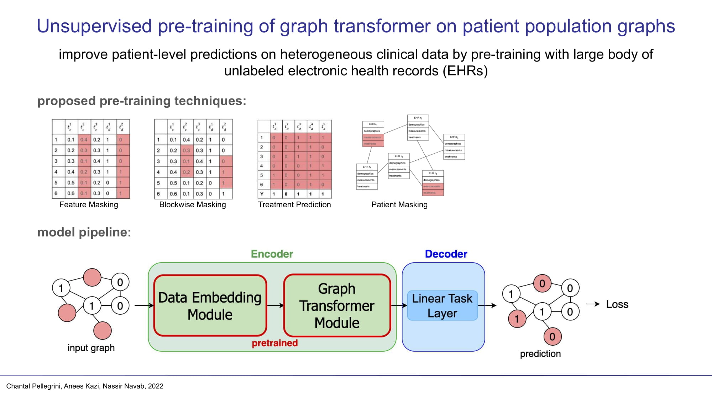

This is the official code to the paper "Unsupervised pre-training of graph transformers on patient population graphs".

## Setup

The code was tested with Python 3.7. The following requirements need to be installed:

```
pip install rdkit-pypi cython
pip install ogb==1.3.1 pytorch-lightning==1.3.0
pip install torch==1.7.1+cu110 torchvision==0.8.2+cu110 -f https://download.pytorch.org/whl/torch_stable.html
pip install torch-geometric==1.6.3 ogb==1.3.1 pytorch-lightning==1.3.1 tqdm torch-sparse==0.6.9 torch-scatter==2.0.6 -f https://pytorch-geometric.com/whl/torch-1.7.0+cu110.html
pip install scikit-learn
pip install pandas
pip install matplotlib
pip install torchinfo
pip install transformers
```

## Run Code

To run our code please execute graphormer/entry.py with appropriate parameters. In the following we provide examples for running the code for
pre-training / downstream task training and fine-tuning on the three datasets. To train on different datasets or tasks please change the following
parameters:

```
--dataset_name: mimic, sepsis, tadpole (for pre-training), tadpole_class (for downstream task training)
--task:
     pre-training tasks on MIMIC-III: pre_mask (feature or blockwise masking), treat_prediction, patient_prediction
     for feature masking set mask_ratio=0.3 and block_size=24, for blockwise masking set mask_ratio=1.0 and block_size=6
     downstream tasks on MIMIC-III: los, acu
     for TADPOLE and sepsis task does not need to be set.
--use_simple_acu_task: set to true to train for our adapted ACU-4 task, false for the original ACU task proposed by McDermott et al.
--label_ratio: to train on a downstream task with limited labels the label ratio can be set to the following values: [0.01, 0.1, 0.5, 1.0]
```

For validation and testing set the following parameters are used:

```
--validate and --test for validation/test
--checkpoint_path for loading a trained model
```

---

### MIMIC-III

Example for pre-training on MIMIC-III, ${fold} can be in [0, 1, 2, 7, 8, 9]:

```
    python -m graphormer.entry --num_workers 8 --seed 1 --batch_size 5 --dataset_name mimic --task pre_mask --gpus 1 --accelerator "ddp" --ffn_dim 256 \
    --hidden_dim 256 --num_heads 8 --dropout_rate 0.4 --intput_dropout_rate 0.4 --attention_dropout_rate 0.4 --weight_decay 0.0 --n_layers 8 \
    --peak_lr 1e-3 --end_lr 1e-4 --edge_type multi_hop --multi_hop_max_dist 20 --warmup_updates 0 --tot_updates 3000 --default_root_dir "exps/mimic_pre_mask" \
    --log_every_n_step 10 --check_val_every_n_epoch 5 --runname "pt24_rot${fold}" --edge_vars "vals" --rotation ${fold} --pad_mode "pad_emb" \
    --mask_ratio 0.3 --block_size 24
```

Example for training on MIMIC-III for Length-of-Stay Prediction:

```
    python -m graphormer.entry --num_workers 8 --seed 1 --batch_size 5 --dataset_name mimic --task los --gpus 1 --accelerator "ddp" --ffn_dim 256 \
    --hidden_dim 256 --num_heads 8 --dropout_rate 0.4 --intput_dropout_rate 0.4 --attention_dropout_rate 0.4 --weight_decay 0.0 --n_layers 8 --peak_lr 1e-4\
    --end_lr 1e-4 --edge_type multi_hop --multi_hop_max_dist 20 --warmup_updates 0 --tot_updates 1200 --default_root_dir "exps/mimic" --log_every_n_step 10\
    --check_val_every_n_epoch 2 --runname "SC_los" --edge_vars "vals" --rotation 0 --label_ratio 1.0 --pad_mode "pad_emb"
```

for fine-tuning add the following parameter to the above command:

```
--pretraining_path "exps/mimic_pre_mask/lightning_logs/<model_name>/checkpoints/best_score.pt"
```

---

### TADPOLE

Example for training on TADPOLE for disease prediction:

```
    python -m graphormer.entry --num_workers 0 --seed 1 --batch_size 1 --dataset_name tadpole_class --gpus 1 --accelerator "ddp" --ffn_dim 64 --hidden_dim 64 \
    --num_heads 8 --dropout_rate 0.4 --intput_dropout_rate 0.4 --attention_dropout_rate 0.4 --weight_decay 0.0 --n_layers 4 --peak_lr 1e-5 --end_lr 5e-6 \
    --edge_type multi_hop --multi_hop_max_dist 20 --check_val_every_n_epoch 1 --warmup_updates 0 --tot_updates 1200 --default_root_dir "exps/tadpole_class" \
    --log_every_n_step 1 --runname "SC_tadpole" --label_ratio 1.0 --drop_val_patients --cross_val
```

instead of doing cross validation the model can be trained on a specific fold of TADPOLE by setting --fold to a number between 0 and 9

---

### Sepsis

Example for fine-tuning on the Sepsis dataset:

```
    python -m graphormer.entry --num_workers 8 --seed 1 --batch_size 5 --dataset_name sepsis --gpus 1 --accelerator "ddp" --ffn_dim 256 --hidden_dim 256 \
   --num_heads 8 --dropout_rate 0.4 --intput_dropout_rate 0.4 --attention_dropout_rate 0.4 --weight_decay 0.0 --n_layers 8 --peak_lr 1e-4 --end_lr 1e-4 \
   --edge_type multi_hop --multi_hop_max_dist 20 --warmup_updates 0 --tot_updates 1500 --default_root_dir "exps/sepsis" --log_every_n_step 10 \
   --check_val_every_n_epoch 1 --runname "FT_sepsis" --label_ratio 1.0 --set_id "AB" --loss_weighting "log" --PT_transformer --rotation ${fold} \
   --pretraining_path "exps/mimic_pre_mask/lightning_logs/<model_name>/checkpoints/best_score.pt"
```

## Graphormer Model

Our model code is based on the work of Ying et al. "Do Transformers Really Perform Badly for Graph Representation?" [1], published in the following
repository [https://github.com/microsoft/Graphormer](https://github.com/microsoft/Graphormer)

[1] Ying, C., Cai, T., Luo, S., Zheng, S., Ke, G., He, D., Shen, Y., Liu, T.Y.: Do transformers really perform badly for graph representation?
Advances in Neural Information Processing Systems 34 (2021)

## Citation
Please cite if you use our code:

```
@misc{https://doi.org/10.48550/arxiv.2203.12616,
  doi = {10.48550/ARXIV.2203.12616},
  url = {https://arxiv.org/abs/2203.12616},
  author = {Pellegrini, Chantal and Kazi, Anees and Navab, Nassir},
  keywords = {Machine Learning (cs.LG), FOS: Computer and information sciences, FOS: Computer and information sciences},
  title = {Unsupervised Pre-Training on Patient Population Graphs for Patient-Level Predictions},
  publisher = {arXiv},
  year = {2022},
  copyright = {arXiv.org perpetual, non-exclusive license}
}
```
